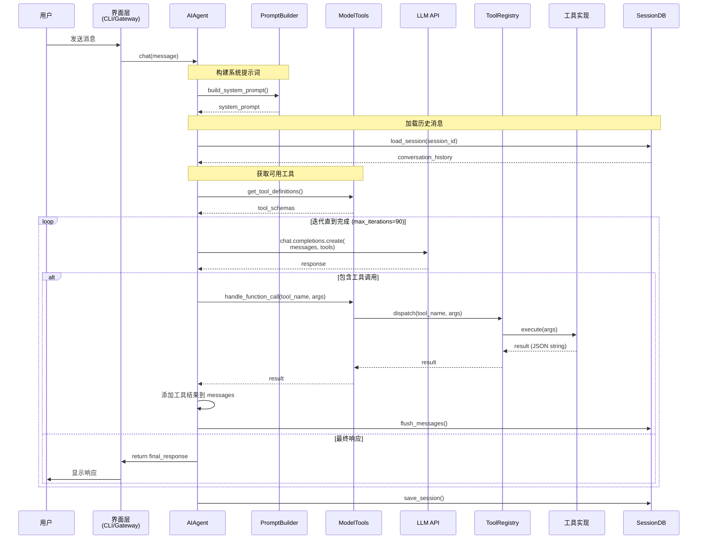
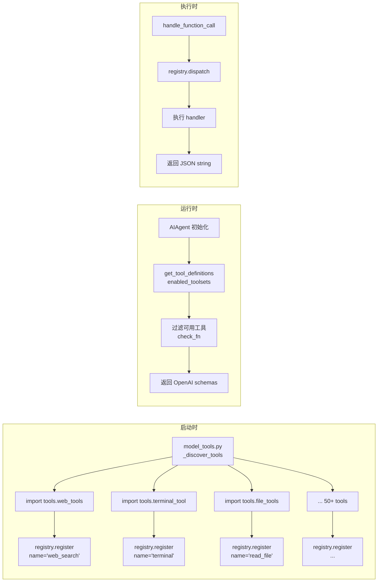
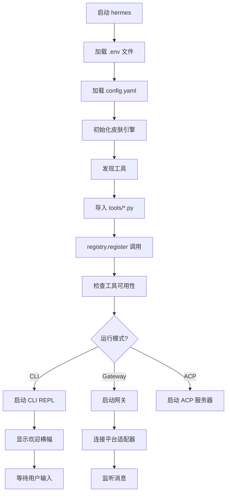
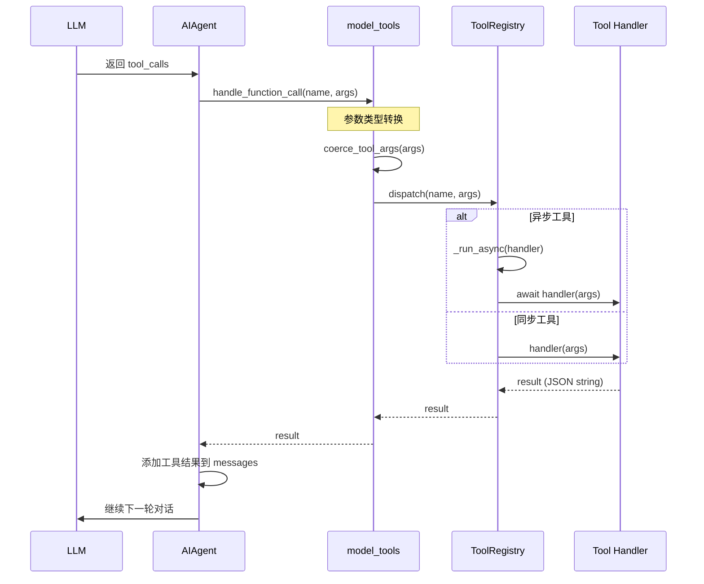
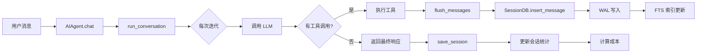
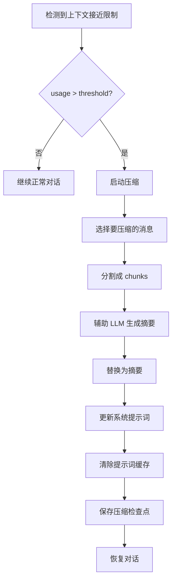

# Hermes Agent 架构设计学习文档

## 📋 目录
1. [项目概述](#项目概述)
2. [核心设计思想](#核心设计思想)
3. [系统架构图](#系统架构图)
4. [核心模块详解](#核心模块详解)
5. [关键流程](#关键流程)
6. [设计模式与最佳实践](#设计模式与最佳实践)

---

## 项目概述

**Hermes Agent** 是一个功能强大的 AI Agent 框架，支持：
- **多平台集成**: CLI、Telegram、Discord、Slack、WhatsApp 等 15+ 消息平台
- **工具生态系统**: 50+ 内置工具（文件操作、终端执行、浏览器自动化、Web搜索等）
- **技能系统**: 可扩展的技能包管理
- **记忆系统**: 持久化会话记忆和跨会话知识
- **子代理委托**: 任务分解和多代理协作
- **上下文压缩**: 智能对话历史管理

---

## 关键概念
ACP： Agent Communication Protocol (ACP)：在AI领域，ACP主要指由AgentUnion于2025年5月9日发布的“智能体通信协议”。它通过一系列规范，
解决了不同来源AI Agent的互联互通问题。它被认为是智能体迈向 “社会化阶段” 的关键基础设施，旨在实现AI Agent功能复用，帮助企业以更低成本开发生产级AI应用。
其地位类似于现代互联网的 TCP/IP协议。例如，一个翻译Agent可以自动调用语音合成Agent，再对接日程管理Agent，为你完成“多语言会议摘要播报”的复杂任务。

## 核心设计思想

### 1. **分层架构 (Layered Architecture)**

```
┌─────────────────────────────────────┐
│     用户界面层 (Interface Layer)      │
│  CLI / Gateway / ACP / API Server   │
└─────────────────────────────────────┘
              ↓
┌─────────────────────────────────────┐
│    代理编排层 (Agent Orchestration)   │
│        AIAgent (run_agent.py)        │
└─────────────────────────────────────┘
              ↓
┌─────────────────────────────────────┐
│   工具调度层 (Tool Orchestration)     │
│      model_tools.py + registry       │
└─────────────────────────────────────┘
              ↓
┌─────────────────────────────────────┐
│    工具实现层 (Tool Implementation)   │
│      tools/*.py (50+ tools)         │
└─────────────────────────────────────┘
              ↓
┌─────────────────────────────────────┐
│   基础设施层 (Infrastructure Layer)   │
│  SessionDB / Config / Logging / Env  │
└─────────────────────────────────────┘
```

**设计原则**:
- **关注点分离**: 每一层只负责特定职责
- **依赖倒置**: 上层通过接口调用下层，不直接依赖实现
- **可替换性**: 每层都可以独立替换或扩展

### 2. **注册表模式 (Registry Pattern)**

#### 工具注册表 (`tools/registry.py`)

```python
# 每个工具文件在导入时自动注册
registry.register(
    name="web_search",
    toolset="web",
    schema={...},
    handler=web_search_handler,
    check_fn=lambda: bool(os.getenv("SEARCH_API_KEY")),
)
```

**优势**:
- ✅ **解耦**: 工具之间互不依赖
- ✅ **动态发现**: 运行时自动加载新工具
- ✅ **条件可用性**: 通过 `check_fn` 控制工具可见性
- ✅ **插件友好**: 第三方工具可以轻松集成

### 3. **工具集抽象 (Toolset Abstraction)**

```python
# toolsets.py - 定义不同场景的工具组合
TOOLSETS = {
    "hermes-cli": {
        "description": "Full interactive CLI toolset",
        "tools": _HERMES_CORE_TOOLS,  # 30+ tools
    },
    "hermes-acp": {
        "description": "Editor integration (VS Code, Zed)",
        "tools": [...],  # 无 messaging/audio 工具
    },
}
```

**设计理念**:
- 同一套工具代码，不同平台按需启用
- 通过 `enabled_toolsets` / `disabled_toolsets` 灵活配置
- 支持工具集组合（includes 机制）

### 4. **异步桥接策略 (Async Bridging Strategy)**

```python
# model_tools.py - 统一的异步处理
def _run_async(coro):
    try:
        loop = asyncio.get_running_loop()
    except RuntimeError:
        loop = None
    
    if loop and loop.is_running():
        # 在已有事件循环中 → 启动新线程
        return run_in_thread(asyncio.run, coro)
    
    if not main_thread():
        # 工作线程 → 使用线程本地循环
        return worker_loop.run_until_complete(coro)
    
    # 主线程 → 使用共享持久循环
    return shared_loop.run_until_complete(coro)
```

**解决的问题**:
- ❌ 避免 "Event loop is closed" 错误
- ❌ 防止嵌套事件循环冲突
- ✅ 兼容同步和异步代码路径

### 5. **状态隔离 (State Isolation)**

#### Profile 系统
```python
# hermes_constants.py
def get_hermes_home():
    """返回当前 profile 的 HERMES_HOME 目录"""
    return Path(os.environ.get("HERMES_HOME", Path.home() / ".hermes"))
```

**隔离维度**:
- 配置文件: `~/.hermes/config.yaml`
- 会话数据库: `~/.hermes/state.db`
- 技能缓存: `~/.hermes/skills/`
- Trajectory 日志: `~/.hermes/sessions/`

### 6. **提示词缓存优化 (Prompt Caching Optimization)**

```python
# run_agent.py - Anthropic Claude 缓存策略
class AIAgent:
    def __init__(self):
        self._use_prompt_caching = (
            self._is_openrouter_url() and "claude" in self.model.lower()
        ) or self.api_mode == "anthropic_messages"
        
    def _apply_cache_control(self, messages):
        """在消息列表上应用 cache-control breakpoints"""
        apply_anthropic_cache_control(messages, strategy="system_and_3")
```

**成本优化**:
- 输入 token 成本降低 ~75%
- 4 个缓存断点（system prompt + 3 条历史消息）
- 5 分钟 TTL（写入成本的 1.25 倍）

---

## 系统架构图

### 整体架构

```mermaid
graph TB
    subgraph "用户界面层"
        CLI[CLI Interface<br/>cli.py]
        Telegram[Telegram Bot<br/>gateway/platforms/telegram.py]
        Discord[Discord Bot<br/>gateway/platforms/discord.py]
        Slack[Slack Bot<br/>gateway/platforms/slack.py]
        ACP[ACP Server<br/>acp_adapter/]
        APIServer[API Server<br/>openai_api_server.py]
    end
    
    subgraph "网关层"
        GatewayRunner[Gateway Runner<br/>gateway/run.py]
        SessionStore[Session Store<br/>gateway/session.py]
        StreamConsumer[Stream Consumer<br/>gateway/stream_consumer.py]
    end
    
    subgraph "代理核心层"
        AIAgent[AIAgent<br/>run_agent.py]
        PromptBuilder[Prompt Builder<br/>agent/prompt_builder.py]
        ContextCompressor[Context Compressor<br/>agent/context_compressor.py]
        MemoryManager[Memory Manager<br/>agent/memory_manager.py]
    end
    
    subgraph "工具调度层"
        ModelTools[Model Tools<br/>model_tools.py]
        ToolRegistry[Tool Registry<br/>tools/registry.py]
        Toolsets[Toolsets<br/>toolsets.py]
    end
    
    subgraph "工具实现层"
        WebTools[Web Tools<br/>tools/web_tools.py]
        TerminalTools[Terminal Tools<br/>tools/terminal_tool.py]
        FileTools[File Tools<br/>tools/file_tools.py]
        BrowserTools[Browser Tools<br/>tools/browser_tool.py]
        MCP[MCP Client<br/>tools/mcp_tool.py]
        DelegateTool[Delegate Tool<br/>tools/delegate_tool.py]
    end
    
    subgraph "基础设施层"
        SessionDB[Session DB<br/>hermes_state.py]
        Config[Config System<br/>hermes_cli/config.py]
        Logging[Logging<br/>hermes_logging.py]
        Plugins[Plugin System<br/>hermes_cli/plugins.py]
    end
    
    CLI --> GatewayRunner
    Telegram --> GatewayRunner
    Discord --> GatewayRunner
    Slack --> GatewayRunner
    ACP --> AIAgent
    APIServer --> AIAgent
    
    GatewayRunner --> SessionStore
    GatewayRunner --> StreamConsumer
    GatewayRunner --> AIAgent
    
    AIAgent --> PromptBuilder
    AIAgent --> ContextCompressor
    AIAgent --> MemoryManager
    AIAgent --> ModelTools
    
    ModelTools --> ToolRegistry
    ModelTools --> Toolsets
    
    ToolRegistry --> WebTools
    ToolRegistry --> TerminalTools
    ToolRegistry --> FileTools
    ToolRegistry --> BrowserTools
    ToolRegistry --> MCP
    ToolRegistry --> DelegateTool
    
    AIAgent --> SessionDB
    Config --> AIAgent
    Config --> GatewayRunner
    Logging --> AIAgent
    Plugins --> ToolRegistry
```



### 代理执行流程



### 工具注册与发现流程



---

## 核心模块详解

### 1. AIAgent 类 (`run_agent.py`)

**职责**: 管理对话循环、工具执行和响应处理

#### 核心方法

```python
class AIAgent:
    def __init__(self, ...):
        """
        参数:
        - model: 模型名称 (e.g., "anthropic/claude-opus-4.6")
        - max_iterations: 最大工具调用迭代次数 (默认 90)
        - enabled_toolsets: 启用的工具集列表
        - platform: 运行平台 ("cli", "telegram", etc.)
        - session_db: SQLite 会话存储实例
        """
    
    def chat(self, message: str) -> str:
        """简单接口 - 返回最终响应字符串"""
    
    def run_conversation(self, user_message: str, ...) -> dict:
        """完整接口 - 返回包含 final_response 和 messages 的字典"""
```

#### 对话循环逻辑

```python
def run_conversation(self, user_message: str, ...):
    # 1. 构建消息历史
    messages = self._build_initial_messages(user_message)
    
    api_call_count = 0
    while api_call_count < self.max_iterations:
        # 2. 检查预算
        if not self.iteration_budget.consume():
            break
        
        # 3. 调用 LLM
        response = client.chat.completions.create(
            model=self.model,
            messages=messages,
            tools=self.tools,
            stream=True  # 支持流式输出
        )
        
        # 4. 处理响应
        if response.tool_calls:
            # 并行执行工具调用
            results = self._execute_tools_parallel(response.tool_calls)
            
            # 添加工具结果到消息历史
            for tool_call, result in zip(response.tool_calls, results):
                messages.append({
                    "role": "tool",
                    "tool_call_id": tool_call.id,
                    "content": result
                })
            
            api_call_count += 1
        else:
            # 5. 返回最终响应
            return {
                "final_response": response.content,
                "messages": messages,
                "api_call_count": api_call_count
            }
```

#### 关键特性

1. **迭代预算管理**
   ```python
   class IterationBudget:
       def consume(self) -> bool:
           """尝试消耗一次迭代，返回是否允许"""
       
       def refund(self):
           """归还一次迭代（用于 execute_code）"""
   ```

2. **并行工具执行**
   ```python
   def _should_parallelize_tool_batch(tool_calls) -> bool:
       """判断工具批次是否可以并行执行"""
       # 排除交互式工具 (clarify)
       # 检查路径冲突 (read_file/write_file)
       # 验证工具安全性 (_PARALLEL_SAFE_TOOLS)
   ```

3. **上下文压缩**
   ```python
   if context_usage > threshold:
       compressor = ContextCompressor(auxiliary_client)
       compressed = compressor.compress(messages)
       self._cached_system_prompt = None  # 触发重建
   ```

4. **中断机制**
   ```python
   def set_interrupt(self, message: str = None):
       """中断当前工具循环"""
       self._interrupt_requested = True
       for child in self._active_children:
           child.set_interrupt(message)
   ```

---

### 2. 工具注册表 (`tools/registry.py`)

**职责**: 集中管理所有工具的元数据和分发

#### 核心数据结构

```python
class ToolEntry:
    """单个工具的元数据"""
    __slots__ = (
        "name",          # 工具名称
        "toolset",       # 所属工具集
        "schema",        # OpenAI 函数调用 schema
        "handler",       # 执行函数
        "check_fn",      # 可用性检查函数
        "requires_env",  # 需要的环境变量
        "is_async",      # 是否为异步工具
        "emoji",         # 显示用 emoji
    )

class ToolRegistry:
    """单例注册表"""
    def __init__(self):
        self._tools: Dict[str, ToolEntry] = {}
        self._toolset_checks: Dict[str, Callable] = {}
```

#### 注册流程

```python
# tools/web_tools.py
from tools.registry import registry

def check_requirements() -> bool:
    return bool(os.getenv("SEARCH_API_KEY"))

def web_search(query: str, task_id: str = None) -> str:
    """执行 Web 搜索"""
    results = search_engine.search(query)
    return json.dumps({"results": results})

# 模块级注册（导入时执行）
registry.register(
    name="web_search",
    toolset="web",
    schema={
        "name": "web_search",
        "description": "Search the web for information",
        "parameters": {
            "type": "object",
            "properties": {
                "query": {"type": "string"}
            },
            "required": ["query"]
        }
    },
    handler=lambda args, **kw: web_search(
        query=args.get("query"),
        task_id=kw.get("task_id")
    ),
    check_fn=check_requirements,
    requires_env=["SEARCH_API_KEY"],
)
```

#### 工具发现流程

```python
# model_tools.py
def _discover_tools():
    """导入所有工具模块以触发注册"""
    _modules = [
        "tools.web_tools",
        "tools.terminal_tool",
        "tools.file_tools",
        "tools.browser_tool",
        # ... 50+ tools
    ]
    for mod_name in _modules:
        importlib.import_module(mod_name)

_discover_tools()  # 模块导入时执行
```

---

### 3. 工具集系统 (`toolsets.py`)

**职责**: 定义和管理工具组合

#### 核心概念

```python
_HERMES_CORE_TOOLS = [
    "web_search", "web_extract",
    "terminal", "process",
    "read_file", "write_file", "patch", "search_files",
    # ... 30+ tools
]

TOOLSETS = {
    "hermes-cli": {
        "description": "Full interactive CLI toolset",
        "tools": _HERMES_CORE_TOOLS,
        "includes": []  # 不包含其他工具集
    },
    "hermes-acp": {
        "description": "Editor integration",
        "tools": [...],  # 无 messaging/audio 工具
        "includes": []
    },
    "debugging": {
        "description": "Debugging toolkit",
        "tools": ["terminal", "process"],
        "includes": ["web", "file"]  # 组合其他工具集
    },
}
```

#### 递归解析

```python
def resolve_toolset(name: str, visited: Set[str] = None) -> List[str]:
    """递归解析工具集，处理组合关系"""
    if name in visited:
        return []  # 防止循环依赖
    
    visited.add(name)
    toolset = TOOLSETS.get(name)
    
    # 收集直接工具
    tools = set(toolset.get("tools", []))
    
    # 递归解析包含的工具集
    for included_name in toolset.get("includes", []):
        included_tools = resolve_toolset(included_name, visited)
        tools.update(included_tools)
    
    return list(tools)
```

---

### 4. 会话数据库 (`hermes_state.py`)

**职责**: 持久化存储会话历史和全文搜索

#### 数据库架构

```sql
CREATE TABLE sessions (
    id TEXT PRIMARY KEY,
    source TEXT NOT NULL,          -- 'cli', 'telegram', 'discord'
    user_id TEXT,
    model TEXT,
    started_at REAL NOT NULL,
    ended_at REAL,
    message_count INTEGER DEFAULT 0,
    input_tokens INTEGER DEFAULT 0,
    output_tokens INTEGER DEFAULT 0,
    estimated_cost_usd REAL,
    title TEXT,
    parent_session_id TEXT         -- 压缩后链式引用
);

CREATE TABLE messages (
    id INTEGER PRIMARY KEY AUTOINCREMENT,
    session_id TEXT NOT NULL REFERENCES sessions(id),
    role TEXT NOT NULL,            -- 'user', 'assistant', 'tool'
    content TEXT,
    tool_calls TEXT,               -- JSON array
    timestamp REAL NOT NULL,
    reasoning TEXT                 -- 思维链内容
);

-- FTS5 全文搜索
CREATE VIRTUAL TABLE messages_fts USING fts5(
    content,
    content=messages,
    content_rowid=id
);
```

#### WAL 模式优化

```python
class SessionDB:
    def __init__(self):
        self._conn = sqlite3.connect(
            str(self.db_path),
            timeout=1.0,              # 短超时
            isolation_level=None,     # 手动事务管理
        )
        self._conn.execute("PRAGMA journal_mode=WAL")
        self._conn.execute("PRAGMA foreign_keys=ON")
    
    def _execute_write(self, fn):
        """带随机退避的写操作"""
        for attempt in range(15):
            try:
                with self._lock:
                    self._conn.execute("BEGIN IMMEDIATE")
                    result = fn(self._conn)
                    self._conn.commit()
                return result
            except sqlite3.OperationalError as exc:
                if "locked" in str(exc).lower():
                    sleep(random.uniform(0.02, 0.15))  # 随机退避
                    continue
                raise
```

**并发优化**:
- WAL 模式允许多读一写
- `BEGIN IMMEDIATE` 立即获取写锁
- 随机退避打破写 convoy
- 每 50 次写操作 checkpoint

---

### 5. 网关系统 (`gateway/run.py`)

**职责**: 管理多平台消息适配器

#### 架构

```python
class GatewayRunner:
    def __init__(self):
        self.adapters = {}  # platform -> adapter instance
        self.session_store = SessionStore()
    
    async def start(self):
        """启动所有配置的适配器"""
        for platform in self.configured_platforms:
            adapter = self._create_adapter(platform)
            await adapter.connect()
            self.adapters[platform] = adapter
    
    async def handle_message(self, event):
        """处理来自任意平台的入站消息"""
        # 1. 创建或恢复会话
        session = self.session_store.get_or_create(event.user_id)
        
        # 2. 创建 AIAgent
        agent = AIAgent(
            model=session.model,
            platform=event.platform,
            session_db=self.session_db,
            session_id=session.id,
        )
        
        # 3. 异步执行对话
        response = await asyncio.to_thread(
            agent.chat, event.message
        )
        
        # 4. 发送响应
        await self.adapters[event.platform].send(
            event.user_id, response
        )
```

#### 平台适配器示例

```python
# gateway/platforms/telegram.py
class TelegramAdapter:
    async def connect(self):
        """连接到 Telegram Bot API"""
        from telegram.ext import Application
        self.app = Application.builder().token(self.token).build()
        self.app.add_handler(MessageHandler(..., self.on_message))
        await self.app.initialize()
        await self.app.start()
    
    async def on_message(self, update, context):
        """处理 Telegram 消息"""
        event = MessageEvent(
            platform="telegram",
            user_id=str(update.effective_user.id),
            message=update.message.text,
        )
        await self.gateway.handle_message(event)
```

---

### 6. 插件系统 (`hermes_cli/plugins.py`)

**职责**: 扩展工具和内存提供者

#### 插件类型

```python
# 1. 工具插件
@hookimpl
def register_tools():
    """注册自定义工具"""
    yield ToolDef(
        name="my_custom_tool",
        toolset="custom",
        schema={...},
        handler=my_tool_handler,
    )

# 2. 内存提供者插件
@hookimpl
def register_memory_providers():
    """注册自定义记忆后端"""
    yield MemoryProviderDef(
        name="honcho",
        factory=HonchoProvider,
    )

# 3. 钩子插件
@hookimpl
def pre_tool_call(tool_name, args, **kwargs):
    """工具执行前拦截"""
    logger.info(f"Calling {tool_name} with {args}")

@hookimpl
def post_tool_call(tool_name, result, **kwargs):
    """工具执行后拦截"""
    logger.info(f"{tool_name} returned {result[:100]}")
```

#### 插件加载

```python
def discover_plugins():
    """发现并加载插件"""
    # 1. 用户插件 (~/.hermes/plugins/)
    user_plugins = Path.home() / ".hermes" / "plugins"
    
    # 2. 项目插件 (./plugins/)
    project_plugins = Path.cwd() / "plugins"
    
    # 3. pip 安装的插件
    for entry_point in pkg_resources.iter_entry_points("hermes.plugins"):
        plugin = entry_point.load()
        plugin_manager.register(plugin)
```

---

## 关键流程

### 1. 启动流程



### 2. 工具调用流程



### 3. 会话持久化流程



### 4. 上下文压缩流程



---

## 设计模式与最佳实践

### 1. **单一职责原则 (SRP)**

✅ **好例子**:
```python
# 每个工具一个文件，只负责自己的逻辑
# tools/web_tools.py - 只做 Web 搜索
# tools/file_tools.py - 只做文件操作
# tools/terminal_tool.py - 只做终端执行
```

❌ **坏例子**:
```python
# 一个大文件包含所有工具逻辑
# tools/all_tools.py - 违反 SRP
```

### 2. **开闭原则 (OCP)**

✅ **添加新工具无需修改现有代码**:
```python
# 只需创建新文件并注册
# tools/my_new_tool.py
registry.register(name="my_tool", ...)

# 无需修改 model_tools.py 或 run_agent.py
```

### 3. **依赖注入 (DI)**

✅ **通过构造函数注入依赖**:
```python
class AIAgent:
    def __init__(self, session_db=None, credential_pool=None):
        self._session_db = session_db
        self._credential_pool = credential_pool
```

### 4. **防御性编程**

✅ **异常处理**:
```python
def handle_function_call(name, args):
    try:
        return registry.dispatch(name, args)
    except Exception as e:
        logger.exception(f"Tool {name} failed")
        return json.dumps({"error": str(e)})
```

✅ **参数验证**:
```python
def coerce_tool_args(tool_name, args):
    """将字符串参数转换为正确的类型"""
    schema = registry.get_schema(tool_name)
    for key, value in args.items():
        expected_type = schema["properties"][key]["type"]
        args[key] = convert(value, expected_type)
```

### 5. **性能优化**

#### 批量写入
```python
# 累积消息后批量刷新
self._message_buffer.append(msg)
if len(self._message_buffer) >= BATCH_SIZE:
    self.flush_messages()
```

#### 缓存策略
```python
# 工具定义缓存
@lru_cache(maxsize=1)
def get_tool_definitions(enabled_toolsets):
    ...

# 模型元数据缓存 (1小时)
fetch_model_metadata.cache_clear()  # 每小时
```

#### 并行执行
```python
# 安全工具并行执行
if _should_parallelize_tool_batch(tool_calls):
    with ThreadPoolExecutor(max_workers=8) as pool:
        results = list(pool.map(execute_tool, tool_calls))
else:
    results = [execute_tool(tc) for tc in tool_calls]
```

### 6. **安全性考虑**

#### 危险命令检测
```python
# tools/approval.py
DESTRUCTIVE_PATTERNS = re.compile(
    r"(rm\s|rmdir\s|mv\s|sed\s+-i|truncate\s|dd\s)"
)

def is_destructive_command(cmd: str) -> bool:
    return bool(DESTRUCTIVE_PATTERNS.search(cmd))
```

#### 环境变量隔离
```python
# 每个 profile 独立的 HERMES_HOME
os.environ["HERMES_HOME"] = str(profile_path)
```

#### API Key 脱敏
```python
# hermes_cli/redact.py
def redact_secrets(text: str) -> str:
    return SECRET_PATTERN.sub("***REDACTED***", text)
```

---

## 总结

### 核心设计原则

1. **模块化**: 清晰的层次结构，每层职责明确
2. **可扩展性**: 注册表模式支持动态插件
3. **高性能**: 并行执行、缓存、批量操作
4. **可靠性**: 异常处理、重试机制、WAL 模式
5. **安全性**: 权限控制、命令审查、密钥管理

### 关键技术决策

| 决策 | 原因 | 影响 |
|------|------|------|
| 注册表模式 | 解耦工具定义和使用 | 易于扩展和维护 |
| 工具集抽象 | 不同平台需要不同工具 | 灵活的权限控制 |
| WAL 模式 | 高并发读写需求 | 更好的并发性能 |
| 异步桥接 | 混合同步/异步代码 | 避免事件循环冲突 |
| Profile 系统 | 多实例隔离需求 | 完全的状态隔离 |

### 学习建议

1. **从入口开始**: `cli.py` 或 `gateway/run.py`
2. **理解核心循环**: `AIAgent.run_conversation()`
3. **掌握工具系统**: `tools/registry.py` 和 `model_tools.py`
4. **探索高级特性**: 上下文压缩、子代理委托、插件系统
5. **阅读测试**: `tests/` 目录展示了各种用法

---

**文档版本**: v1.0  
**最后更新**: 2026-04-11  
**适用版本**: Hermes Agent v0.8.0+
